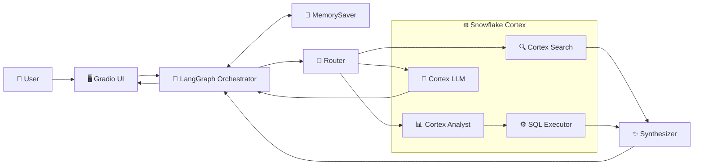

# ❄️ Snowflake Cortex × LangGraph Integration

A multi-mode AI assistant that connects **Snowflake Cortex** services (Search, Analyst, LLM) with **LangGraph** for intelligent query routing, text-to-SQL, document retrieval, and conversational analytics — with a Gradio web UI featuring live thinking traces and auto-generated charts.

## Architecture



See [architecture.md](architecture.md) for the full detailed diagram.

## Features

- **Two modes**: Cortex Agent (thin wrapper) and LangGraph Orchestrator (multi-step reasoning)
- **Intent-based routing**: Automatically classifies queries as search, SQL, both, general, or clarification
- **Text-to-SQL**: Cortex Analyst generates SQL from natural language; SQL Executor runs it
- **Document retrieval**: Cortex Search for unstructured conversation/meeting data
- **Conversation memory**: LangGraph MemorySaver checkpointer persists state across turns
- **Query rewriting**: Follow-up questions like "their dates?" automatically resolve to standalone queries
- **Live thinking trace**: Streams step-by-step agent reasoning as nodes execute
- **Auto-generated charts**: Plotly charts auto-detected from SQL results (bar, pie, line, scatter)
- **Multi-step refinement**: Synthesizer can loop back up to 3 times for incomplete answers

## Project Structure

```
cortex_langgraph_integration/
├── main.py                          # Entry point (CLI + Gradio UI)
├── .env                             # Snowflake credentials & config
├── requirements.txt                 # Python dependencies
├── architecture.md                  # Mermaid architecture diagrams
│
├── common/                          # Shared utilities
│   ├── config.py                    # Environment variable loader
│   ├── cortex_tools.py              # Cortex API wrappers (Search, Analyst, LLM, SQL)
│   ├── chart_helper.py              # Auto chart generation (Plotly)
│   ├── query_rewriter.py            # Follow-up → standalone query rewriter
│   └── logging_config.py            # Rotating file + console logging
│
├── agent_mode/                      # Cortex Agent wrapper
│   ├── graph.py                     # LangGraph StateGraph for agent mode
│   ├── cortex_client.py             # Cortex Agent API client
│   ├── response_parser.py           # Agent response parser
│   └── state.py                     # Agent state schema
│
├── orchestrator_mode/               # LangGraph orchestrator
│   ├── graph.py                     # StateGraph with MemorySaver checkpointer
│   ├── state.py                     # OrchestratorState (with operator.add reducer)
│   └── nodes/                       # Graph nodes
│       ├── router.py                # Intent classification
│       ├── search.py                # Cortex Search node
│       ├── analyst.py               # Cortex Analyst (text-to-SQL)
│       ├── sql_executor.py          # SQL execution node
│       ├── llm.py                   # Direct LLM node
│       ├── synthesizer.py           # Result synthesis node
│       └── human_review.py          # Clarification node
│
└── ui/
    └── app.py                       # Gradio Blocks UI (chat, trace, charts)
```

## Prerequisites

- **Python 3.10+**
- **Snowflake account** with Cortex services enabled
- **Snowflake PAT** (Programmatic Access Token) for authentication
- Cortex Search service, Cortex Analyst semantic model, and a warehouse configured

## Installation

1. **Clone the repository**

   ```bash
   git clone <repo-url>
   cd cortex_langgraph_integration
   ```

2. **Create a virtual environment**

   ```bash
   python -m venv venv

   # Windows
   .\venv\Scripts\activate

   # macOS/Linux
   source venv/bin/activate
   ```

3. **Install dependencies**

   ```bash
   pip install -r requirements.txt
   ```

4. **Configure environment variables**

   Copy the example file and fill in your Snowflake credentials:

   ```bash
   cp .env.example .env    # macOS/Linux
   copy .env.example .env  # Windows
   ```

   Then edit `.env` with your values. At minimum you need:
   - `SNOWFLAKE_ACCOUNT_URL` — your Snowflake account URL
   - `SNOWFLAKE_PAT` — a Programmatic Access Token (generate from Snowsight > User menu > Security)
   - `SNOWFLAKE_WAREHOUSE` — warehouse for SQL API calls

   See [.env.example](.env.example) for all available settings.

## Usage

### Web UI (default)

```bash
python main.py
```

Opens a Gradio app at `http://127.0.0.1:7860` with:
- **Mode toggle**: Switch between Cortex Agent and LangGraph Orchestrator
- **Chat interface**: Ask questions about your sales data
- **🧠 Agent Thinking**: Live step-by-step trace of agent reasoning
- **📊 Chart**: Auto-generated Plotly charts from SQL results
- **🔧 Tool Outputs**: Raw tool call details

### CLI Mode

```bash
# Orchestrator mode (default)
python main.py --cli --mode orchestrator

# Agent mode
python main.py --cli --mode agent
```

### Example Queries

```
What is the revenue by each sales rep?
Show me monthly revenue trend by close date.
How many deals did Sarah win compared to lost?
What was discussed in the meeting with TechCorp?
their dates?  ← follow-up resolved via query rewriter
```

## How It Works

1. **User sends a message** → Gradio UI passes it to the LangGraph orchestrator
2. **Router node** classifies intent using Cortex LLM (`search` / `sql` / `both` / `general` / `clarify`)
3. **Tool nodes** execute based on intent:
   - `search` → Cortex Search for unstructured retrieval
   - `sql` → Cortex Analyst (text-to-SQL) → SQL Executor (runs the query)
   - `both` → Search then Analyst sequentially
   - `general` → Direct LLM response
   - `clarify` → Ask user for more detail
4. **Synthesizer** merges tool outputs into a natural language answer
5. **UI updates** stream in real-time: thinking trace appears step-by-step, chart auto-generates from SQL results
6. **MemorySaver** persists conversation state per `thread_id` for multi-turn context

## Snowflake Cortex APIs Used

| API | Endpoint | Purpose |
|-----|----------|---------|
| Cortex Search | `POST /api/v2/databases/{db}/schemas/{schema}/cortex-search-services/{svc}:query` | Unstructured document retrieval |
| Cortex Analyst | `POST /api/v2/cortex/analyst/message` | Text-to-SQL with semantic model |
| Cortex LLM | `SNOWFLAKE.CORTEX.COMPLETE()` via `/api/v2/statements` | LLM inference (routing, synthesis, rewriting) |
| SQL Statements | `POST /api/v2/statements` | Execute SQL queries |
