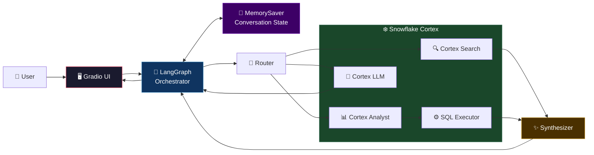
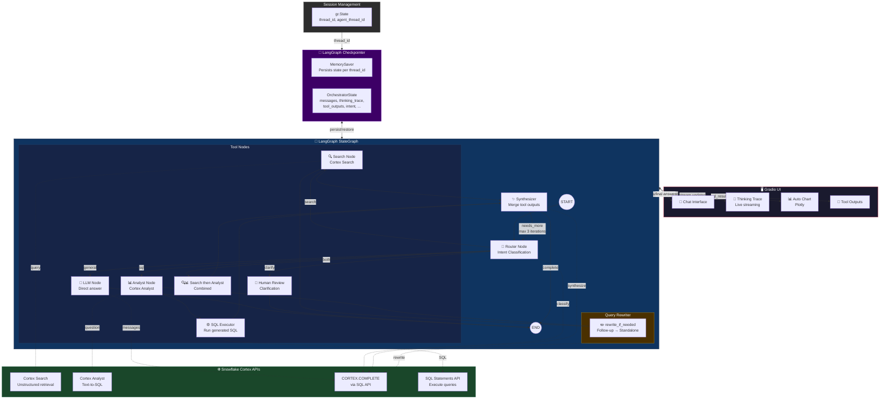

# Cortex × LangGraph — Architecture

## High-Level

```mermaid
graph LR
    User["👤 User"] --> UI["🖥️ Gradio UI"]
    
    UI --> LG["🔄 LangGraph<br/>Orchestrator"]
    LG --> UI
    
    LG <--> Mem["💾 MemorySaver<br/>Conversation State"]
    
    LG --> Router["🧭 Router"]
    Router --> Search["🔍 Cortex Search"]
    Router --> Analyst["📊 Cortex Analyst"]
    Router --> LLM["🤖 Cortex LLM"]
    
    Analyst --> SQL["⚙️ SQL Executor"]
    
    Search --> Synth["✨ Synthesizer"]
    SQL --> Synth
    Synth --> LG
    LLM --> LG

    subgraph Snowflake["❄️ Snowflake Cortex"]
        Search
        Analyst
        LLM
        SQL
    end

    style Snowflake fill:#1a472a,stroke:#2d6a4f,color:#fff
    style LG fill:#0f3460,stroke:#3282b8,color:#fff
    style Mem fill:#3d0066,stroke:#6a0dad,color:#fff
    style UI fill:#1a1a2e,stroke:#e94560,color:#fff
    style Synth fill:#4a3000,stroke:#b8860b,color:#fff
```

## Detailed

```mermaid
graph TB
    subgraph UI["🖥️ Gradio UI"]
        Chat["💬 Chat Interface"]
        Trace["🧠 Thinking Trace<br/>Live streaming"]
        Chart["📊 Auto Chart<br/>Plotly"]
        Tools["🔧 Tool Outputs"]
    end

    subgraph Session["Session Management"]
        GrState["gr.State<br/>thread_id, agent_thread_id"]
    end

    subgraph LG["🔄 LangGraph StateGraph"]
        direction TB
        START((START))
        Router["🧭 Router Node<br/>Intent Classification"]
        
        subgraph QR["Query Rewriter"]
            Rewrite["✏️ rewrite_if_needed<br/>Follow-up → Standalone"]
        end

        subgraph ToolNodes["Tool Nodes"]
            Search["🔍 Search Node<br/>Cortex Search"]
            Analyst["📊 Analyst Node<br/>Cortex Analyst"]
            SQLExec["⚙️ SQL Executor<br/>Run generated SQL"]
            LLM["🤖 LLM Node<br/>Direct answer"]
            HumanReview["👤 Human Review<br/>Clarification"]
            Both["🔍📊 Search then Analyst<br/>Combined"]
        end

        Synth["✨ Synthesizer<br/>Merge tool outputs"]
        END_NODE((END))

        START --> Router
        Router -->|search| Search
        Router -->|sql| Analyst
        Router -->|both| Both
        Router -->|general| LLM
        Router -->|clarify| HumanReview

        Search --> Synth
        Analyst --> SQLExec --> Synth
        Both --> Synth
        LLM --> END_NODE
        HumanReview --> END_NODE
        Synth -->|complete| END_NODE
        Synth -->|needs_more<br/>max 3 iterations| Router
    end

    subgraph CP["💾 LangGraph Checkpointer"]
        Mem["MemorySaver<br/>Persists state per thread_id"]
        State["OrchestratorState<br/>messages, thinking_trace,<br/>tool_outputs, intent, ..."]
    end

    subgraph Cortex["❄️ Snowflake Cortex APIs"]
        CSearch["Cortex Search<br/>Unstructured retrieval"]
        CAnalyst["Cortex Analyst<br/>Text-to-SQL"]
        CLLM["CORTEX.COMPLETE<br/>via SQL API"]
        CSQL["SQL Statements API<br/>Execute queries"]
    end

    Chat -->|user_message| LG
    LG -->|stream updates| Trace
    LG -->|sql_results| Chart
    LG -->|final answer| Chat
    LG -->|tool_outputs| Tools

    GrState -->|thread_id| CP
    CP <-->|persist/restore| LG

    Search -.->|query| CSearch
    Analyst -.->|question| CAnalyst
    LLM -.->|messages| CLLM
    SQLExec -.->|SQL| CSQL
    Router -.->|classify| CLLM
    Synth -.->|synthesize| CLLM
    Rewrite -.->|rewrite| CLLM

    Search --- Rewrite
    Analyst --- Rewrite

    style UI fill:#1a1a2e,stroke:#e94560,color:#fff
    style LG fill:#0f3460,stroke:#16213e,color:#fff
    style Cortex fill:#1a472a,stroke:#2d6a4f,color:#fff
    style CP fill:#3d0066,stroke:#6a0dad,color:#fff
    style QR fill:#4a3000,stroke:#b8860b,color:#fff
    style ToolNodes fill:#162447,stroke:#1f4068,color:#fff
    style Session fill:#2d2d2d,stroke:#555,color:#fff
```
